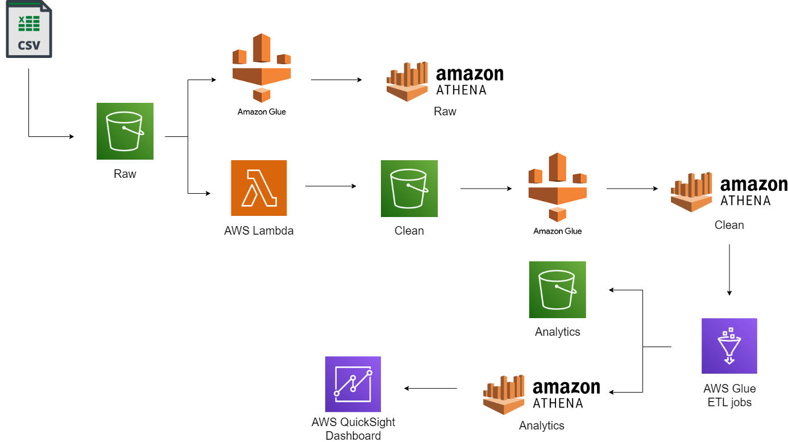
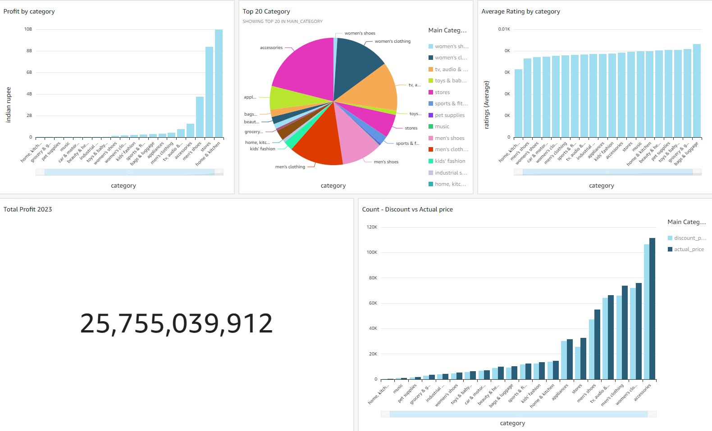

# Amazon Products Sales Analysis

## Introduction:

This project aims to provide a comprehensive analysis of Amazon product sales using various data sources and leveraging AWS cloud services. The entire process involves data extraction, transformation, and loading (ETL) to handle large datasets efficiently. The data is stored at different stages, including raw, clean, and analytics, within a data lake and tables. Ultimately, a dashboard is created for improved data visualization to answer specific business questions.

## Data Architecture Diagram

## Project Steps:

**Step 1: Data Source Preparation**

Use data source(Amazon Products Sales Dataset 2023).
https://www.kaggle.com/datasets/lokeshparab/amazon-products-dataset
Remove files from the dataset that only contain headers to ensure data integrity.

**Step 2: Data Ingestion**

Set up a Lambda function trigger to preprocess the raw dataset before it arrives in the S3 raw bucket.
This preprocessing includes transforming the data into the proper format and changing the CSV delimiter to '#' for improved data reading in the Glue Data Catalog.

**Step 3: Raw Data Storage and Data Catalog Creation**

Upload the raw dataset to an S3 raw bucket and create a raw table in Athena using the glue data catalog.

**Step 4: Clean Data Processing, Data Catalog**

After uploading the raw dataset, the Lambda function is automatically triggered for additional data transformations.
Store the cleaned dataset in the S3 clean bucket. 
Use glue data catalog to construct a clean table in Athena and ensure that the data is clean.

**Step 5: Data Transformation and Analytics**

Implement ETL processes using Glue jobs to create Parquet format files.
Create an analytics table in Amazon Athena for efficient data querying.
Store the analytics dataset in the S3 analytics bucket.

**Step 6: Data Visualization**

Utilize Amazon QuickSight to visualize the analytics dataset and construct a user-friendly dashboard.
This dashboard provides meaningful insights and facilitates data-driven decision-making.

## Dashboard

